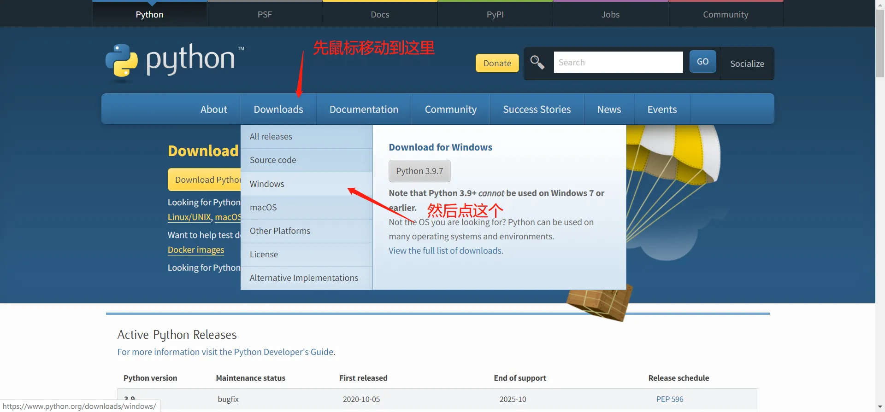
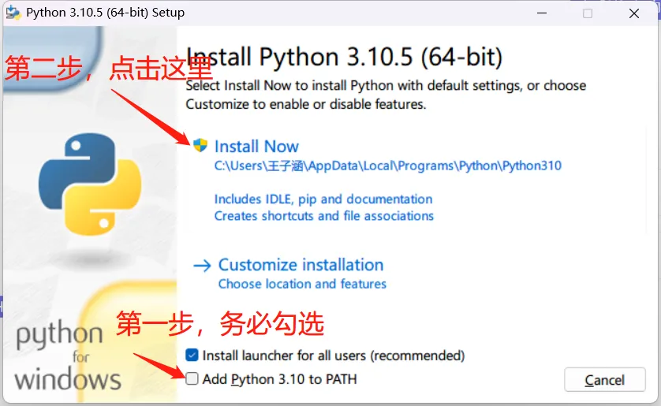
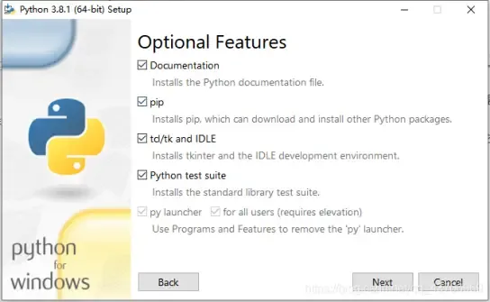
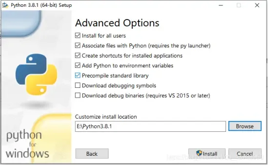
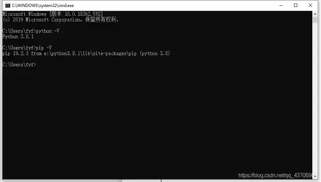

# 0.3 Python环境安装

由于精力有限，本文介绍的是 `Python 3.x` 在 `Windows` 平台下的安装，其他版本操作类似可直接自行准备安装包安装，其他操作系统请自行百度。

## 1. 下载

首先从官网打开下载界面，下载自己需要的版本



众所周知由于不可抗力因素在中国访问这种境外网站速度较慢，所以附上 `Python 3.8.5 Windows 64位` 版本的安装包，大家可以直接下载（来自腾讯软件中心）：

[https://dl.softmgr.qq.com/original/Development/python-3.8.5-amd64.exe](https://dl.softmgr.qq.com/original/Development/python-3.8.5-amd64.exe)

## 2. 安装

> 说实话，Python是所有语言中安装起来最容易的了，没有之一。

双击运行安装程序，按如图所示操作



**最底下那一行一定记得勾选！！两个复选框都要是选中状态！**

如果你选择默认安装，至此就可以等着进度条结束直接跳到步骤3了

选择了自定义请继续看下面的步骤：

（1）点击Customize Installation之后，来到这个界面，这里默认全选，直接点next即可。



（2）在这一步，要注意的是要勾选上第一个框Install for all users，勾选上之后第五个框也会跟着自动选中。然后我们可以更改一下安装路径，大家可以根据自己的习惯进行选择。



（3）点击Install之后，等待安装完成即可

## 3. 验证

（1）打开cmd（按下Win+R，输入cmd，回车）

（2）输入python -V以及pip -V（注意有个空格，且V大写），看到如下图信息，即代表安装成功，并且环境变量添加成功。如果提示 `python不是内部或外部命令,也不是可运行程序或批处理文件` ，则说明**你在上一步打开安装程序的界面最底下的对勾没有勾选**，请卸载重装或自行百度解决。



## 4. 更换 PyPI 镜像源

极力建议你在刚刚打开的 cmd 中执行如下代码：

```powershell
pip3 config set global.index-url https://pypi.tuna.tsinghua.edu.cn/simple
```

这个代码是更改 PyPI 的默认下载源，往后讲到第三部分时会详细介绍。
