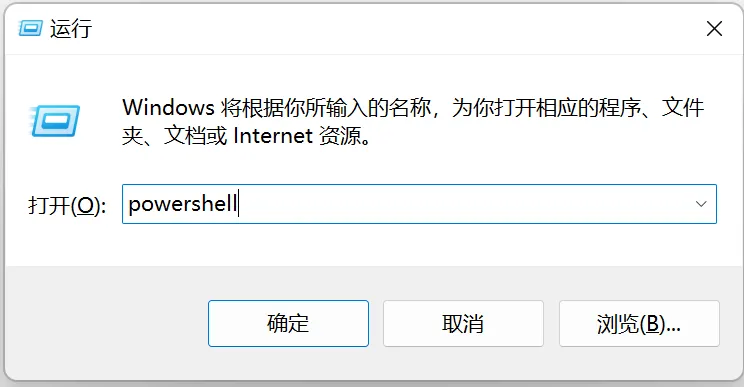
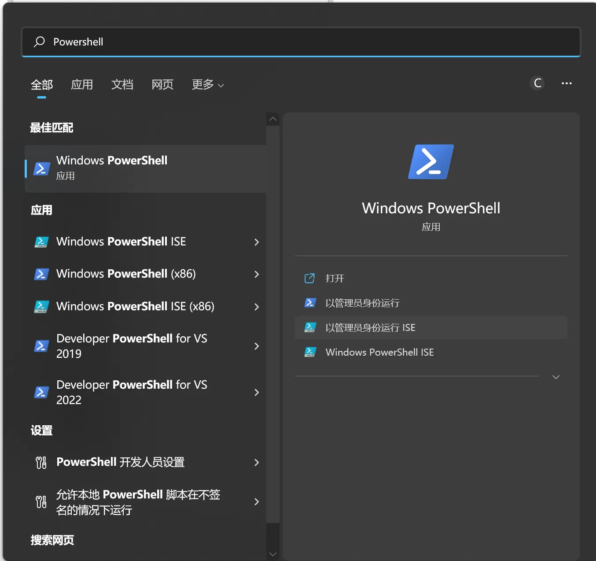
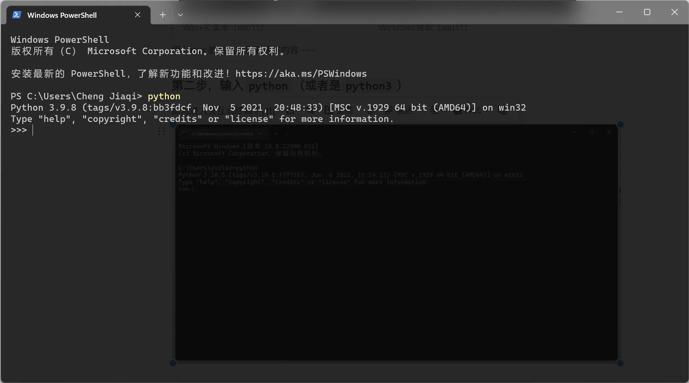
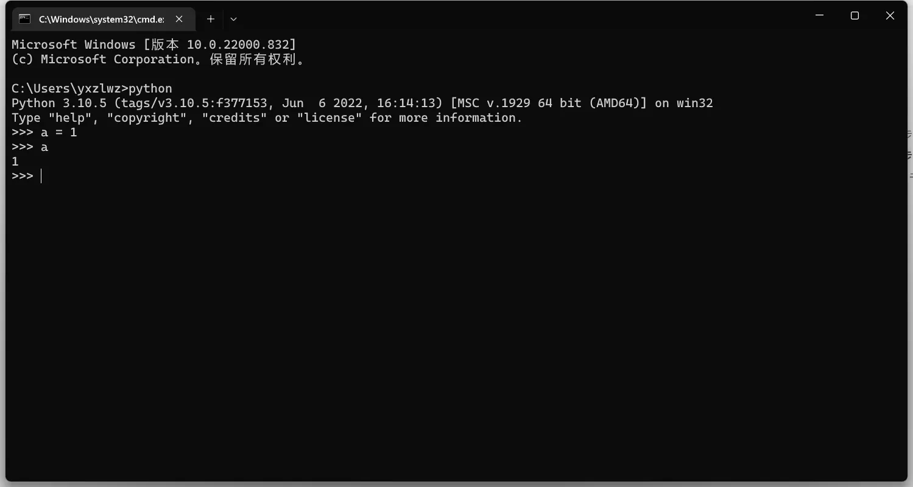
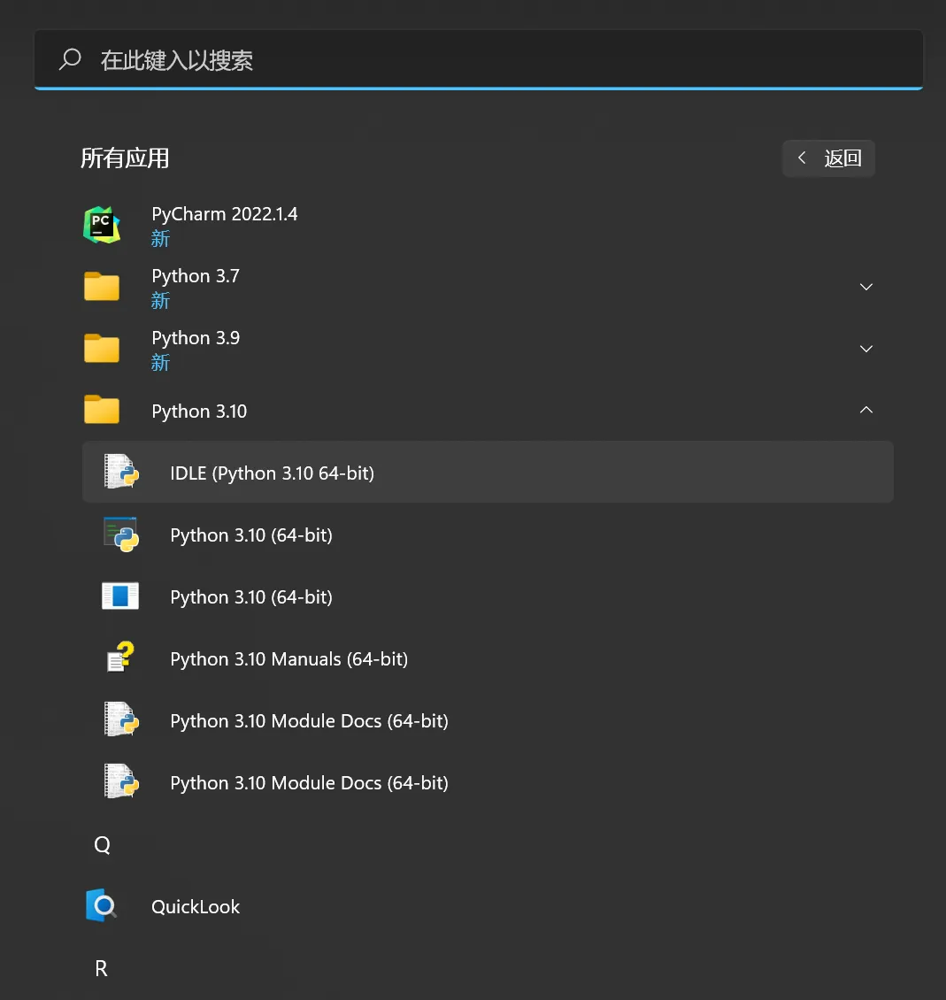
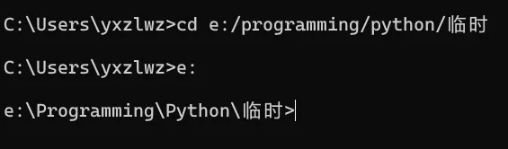
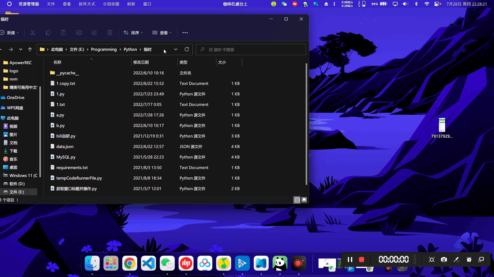
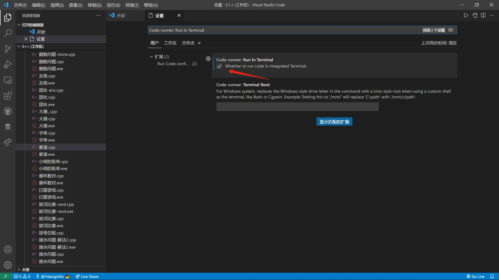
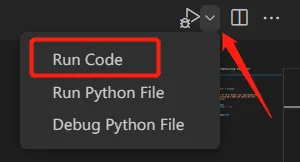
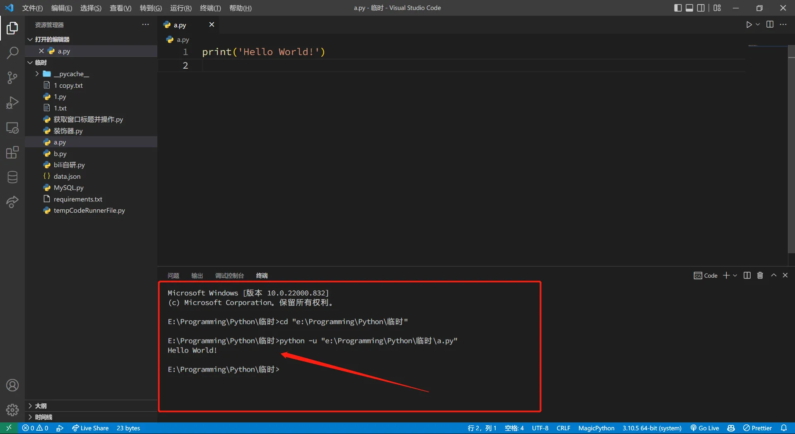

# 0.5 如何运行Python代码

无论采用下面所介绍的哪一种运行方式，你都需要在电脑上安装好 Python 环境，具体可以参考前面几节的内容。

## 交互式运行

### 第一步，打开电脑的命令行工具

Windows 打开方式：按下`Win + R`组合键，输入`powershell`，回车打开。

也可以使用Windows开始菜单搜索，也是可以的。

> 快捷键：`Win + X`呼出的菜单中同样可以找到
> 特别注意：win10菜单中显示的是“Windows PowerShell“，而win11菜单中显示的是“Windows 终端”
> 

### 第二步，输入`python`（或者是`python3`）

即可进入**交互式终端 Python Shell**。

### 第三步，书写代码

在这里输入的的代码每敲击一次回车就会被实时运行出来，可随时查看各个表达式的值——甚至不需要`print()`。缺点就是运行的代码不能保存。我们通常使用这一交互式终端测试 Python 语法或者学习新接触的库。

### 退出 Python Shell

> 此节对于使用 Linux Server 的同学们可能……有所帮助。但是对于有操作界面（GUI）的话，可直接参阅方式三，或者直接略过——我相信有人已经可以无师自通了。

- 方式一：

快捷键`Ctrl + Z`，然后回车。

- 方式二：

手动在 Shell 中输入：`exit()`后，回车执行命令

- 方式三：

看到这个黑框框右上角的那个叉叉了吗？对，点一下就行了。

### 另一种方式：Python IDLE

你可以直接在Windows的开始菜单中找到它。点击后，你会得到一个可交互运行的窗口，使用方式与 Python Shell 无二。

## 运行 Python 文件

### 第一步，还是打开命令行工具

### 第二步，`cd`切换到`.py`文件所在的目录

在 cmd 中，如果文件不在 C 盘，可能需要我们`cd`后再切换一次：

亦或者，直接在 Windows 文件资源管理器地址栏单机空白区域，输入`cmd`或`Power Shell` (下图以cmd做演示) ，然后回车：

> 此时唤出的CMD命令行的目录已经处于当前文件夹下。

## 使用 Visual Studio Code

这才是我们运行 Python 文件通常的方式。

### 首先从官网下载安装

[Visual Studio Code - Code Editing. Redefined](https://code.visualstudio.com/)

> 网信办为了保护我国脆弱的人民似乎把这个网站也墙掉了，访问极不稳定。

### 打开软件，安装插件

使用`Ctrl + Shift + X`打开插件安装界面。推荐安装如下内容：

- `Chinese (Simplified) (简体中文) Language Pack for Visual Studio Code`：中文语言包
- `Python`：对 Python 语言的较完整支持
- `Code Runner`：代码运行插件

### 必要的设置

针对`Code Runner`需要做一些配置：按下快捷键`Ctrl + ,`打开设置界面，在搜索框输入`Code-runner: Run In Terminal`，勾选前面的对勾（如果找不到这一个设置项，请重启软件）：

设置中还有关于编辑器字体大小的配置，可自行按需调整。

### 新建代码文件，编辑好后保存运行

可以点击右上角的运行按钮或者按下快捷键`Ctrl + Alt + N`（推荐；Mac为`control + option + N`）。如果你的运行按钮如下图所示，有一个爬虫的角标：

请点击下拉三角，选择`Run Code`选项。

代码文件将在下方的终端运行出来。

请一定记得**先保存再运行代码**。如果你的代码有用到`input`函数，请先**用鼠标在图中箭头位置单击**以选定焦点位置，再进行输入。

> 另一个小技巧：你可以在顶部菜单的“文件”中找到“自动保存”并勾选。

Windows下的 VSC 终端就是一个 CMD 或 PowerShell （上图红框中为PowerShell），你也可以直接在里面写你要执行的命令。默认情况下打开的是一个 PowerShell 。

> 注意：对于Windows用户，**PowerShell 和 CMD 在命令语法上有些许区别，请务必注意区分！**
