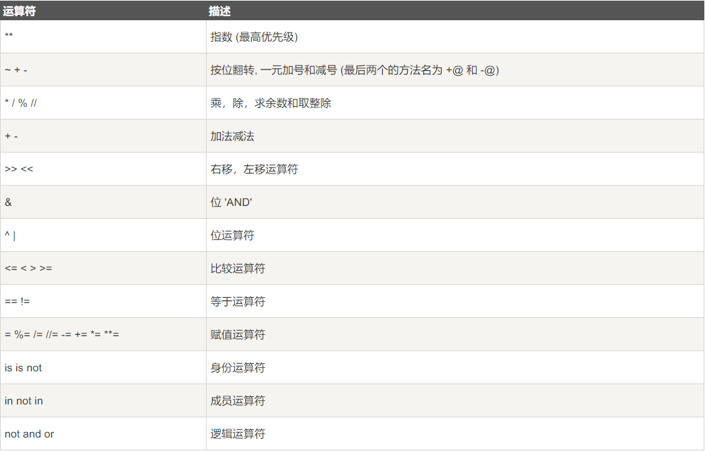

# 1.3 数值运算

## 例01 数值运算

计算机最古老的用途是数值计算，所以这固然也是所有编程语言最重要的部分。对于数值的运算符如下：

| 运算符 | 说明 | 样例 | 特殊说明 |
| --- | --- | --- | --- |
| 所有 |  |  | float运算在所有计算中均可能出现数位错误，请查看下方「例04 小数」 |
| + | 加法运算 | `1 + 1` 输出 `2` |  |
| - | 加法运算 | `1 - 1` 输出 `0` |  |
| * | 乘法运算 | `2 * 3` 输出 `6` |  |
| / | 除法运算 | `3 / 2` 输出 `1.5` | 无论结果是否为整数都返回float类型 |
| % | 取余运算 | `10 % 3` 输出 `1` |  |
| \*\* | 次幂运算 | `2 ** 3` 输出 `8`；`2 ** 0.5` 输出 `1.414...` | 也可以用函数实现：`pow(2, 3)` |
| // | 整除运算 | `10 // 3` 输出 `1` | 返回int类型，舍弃小数而非四舍五入 |

代码实现如下：

```python
a = 21
b = 10
c = 0

c = a + b
print ("1: c 的值为：", c)

c = a - b
print ("2: c 的值为：", c)

c = a * b
print ("3: c 的值为：", c)

c = a / b
print ("4: c 的值为：", c)

c = a % b
print ("5: c 的值为：", c)

a = 2
b = 3
c = a**b 
print ("6: c 的值为：", c)

a = 10
b = 5
c = a//b 
print ("7: c 的值为：", c)
```

输出内容：

```
1: c 的值为： 31
2: c 的值为： 11
3: c 的值为： 210
4: c 的值为： 2.1
5: c 的值为： 1
6: c 的值为： 8
7: c 的值为： 2
```

## 例02 赋值运算

计算机最古老的用途是数值计算，所以这固然也是所有编程语言最重要的部分。对于数值的运算符如下：

| 运算符 | 说明 | 实例 |
| --- | --- | --- |
| = | 简单的赋值运算符 | c = a + b 将 a + b 的运算结果赋值为 c |
| += | 加法赋值运算符 | c += a 等效于 c = c + a |
| -= | 减法赋值运算符 | c -= a 等效于 c = c - a |
| \*= | 乘法赋值运算符 | c \*= a 等效于 c = c * a |
| /= | 除法赋值运算符 | c /= a 等效于 c = c / a |
| %= | 取余赋值运算符 | c %= a 等效于 c = c % a |
| \*\*= | 幂赋值运算符 | c \*\*= a 等效于 c = c \*\* a |
| //= | 整除赋值运算符 | c //= a 等效于 c = c // a |

代码实现如下：

```python
a = 21
b = 10
c = 0

c = a + b
print ("1 - c 的值为：", c)

c += a
print ("2 - c 的值为：", c)

c *= a
print ("3 - c 的值为：", c)

c /= a 
print ("4 - c 的值为：", c)

c = 2

c %= a
print ("5 - c 的值为：", c)

c **= a
print ("6 - c 的值为：", c)

c //= a
print ("7 - c 的值为：", c)
```

输出内容：

```
1 - c 的值为： 31
2 - c 的值为： 52
3 - c 的值为： 1092
4 - c 的值为： 52.0
5 - c 的值为： 2
6 - c 的值为： 2097152
7 - c 的值为： 99864
```

除此之外，Python3.8 版本新增海象运算符 `:=` ，可在表达式内部为变量赋值。实例如下：

```python
if n := 10 != 0:
    print(n)

# 输出：10
```

## 例03 位运算（按需了解）

鉴于在实用领域位运算使用较少，加上与其它编程语言完全一样的语法，这里不再赘述位运算的运算符详解，直接贴出 [菜鸟教程《Python3：运算符》](https://www.runoob.com/python3/python3-basic-operators.html) 的样例代码。如果你希望详细了解这一内容，可以点击超链接访问官网。

```python
a = 60           # 60 = 0011 1100 
b = 13           # 13 = 0000 1101 
c = 0

c = a & b        # 12 = 0000 1100
print ('#1 c的值为：', c)

c = a | b        # 61 = 0011 1101 
print ('#2 c的值为：', c)

c = a ^ b        # 49 = 0011 0001
print ('#3 c的值为：', c)

c = ~a           # -61 = 1100 0011
print ('#4 c的值为：', c)

c = a << 2       # 240 = 1111 0000
print ('#5 c的值为：', c)

c = a >> 2       # 15 = 0000 1111
print ('#6 c的值为：', c)
```

输出内容：

```
#1 c的值为： 12
#2 c的值为： 61
#3 c的值为： 49
#4 c的值为： -61
#5 c的值为： 240
#6 c的值为： 15
```

Python的运算顺序基本符合数学中的定义，同时也支持通过使用小括号来改变运算顺序。但是Python只能使用小括号，如果有多级运算顺序需要改变，只需要多嵌套几层小括号就好，**不要随意使用中括号和大括号**，它们通常有特殊含义。

下表中列出的是Python中所有运算符的优先级关系。部分内容我们赞数没有说到，大家参考已经掌握的即可。



## 例04 小数

**2025.9.7注：我有点忘了我当时为什么会在这个新手文档里留下这么离谱的东西……大家跳过这一块吧（：**

Python 中的 `float` 对象是基于 **IEEE 二进制浮点数算数标准 (IEEE 754)**，即

> 浮点数的**实际值**，等于符号位（sign bit）乘以**指数偏移值**(exponent bias)再乘以**分数值**(fraction)。

而 IEEE 754 无法表示所有浮点数，比如 `0.1 + 0.2 = 0.3000...0004`。

这时候，我们就需要[十进制定点和浮点运算库 decimal](https://docs.python.org/zh-cn/3/library/decimal.html)。
