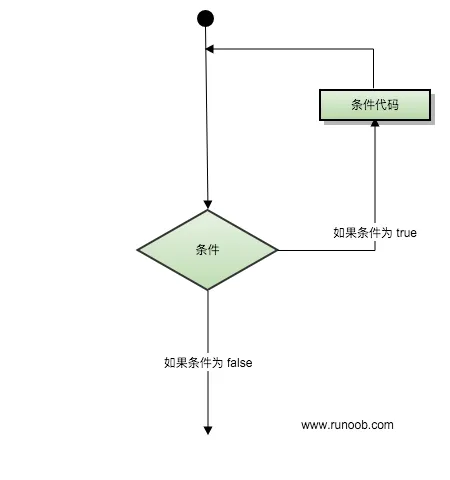

# 1.10 while语句

## 简介

`while`语句的格式：

```python
while 条件表达式:
	循环体
```

`while`会判断后面的判断表达式是否为`True`：

- 如果为`True`，就执行循环体，当循环体执行完，再次回到`while`语句，继续判断是否为`True`
- 不为`True`，跳出循环

具体流程可以参考下图：



## 简单的示例

```python
cnt = 0
while cnt <= 3:
	print(cnt)
	cnt += 1
```

输出：

```
0
1
2
3
```

单步执行（右上角为`cnt`变量当前的值）：


## 无限循环

通过前文的介绍，我们知道只要条件表达式结果始终为`True`，那么`while`就会一直执行。于是我们可以这样操作：

```python
while True:
	print("这是一个无限循环")
```

输出：

```
这是一个无限循环
这是一个无限循环
这是一个无限循环
这是一个无限循环
这是一个无限循环
这是一个无限循环
这是一个无限循环
这是一个无限循环
……
```

如果你运行了这个程序，可以用快捷键`Ctrl + C`终止它。

当然，在我们真正开发的过程中，这样的死循环是要尽量避免的。即便使用，也一定要注意在适当的位置加上`break`

## break 和 continue

### break

```python
cnt = 0
while cnt < 10:
	cnt += 1
	if cnt == 5:
		break
print(cnt)  # 输出：5
```

`break`语句用来终止循环语句，即哪怕循环条件没有转为`False`，也会停止执行循环语句。

### continue

```python
cnt = 0
while cnt < 10:
	cnt += 1
	if cnt % 2 == 0:
		continue
	print(cnt)

# 输出：
# 1
# 3
# 5
# 7
# 9
```

`continue`语句用来告诉 Python 跳过当前循环的剩余语句，然后继续进行下一轮循环（`continue`语句跳出本次循环，而`break`跳出整个循环）。

### break 和 continue 的作用范围

> 该内容相对而言不那么新手友好，可选择性掌握。

如果您使用嵌套循环，`break`和`continue`语句将停止执行**最深层**的循环，并开始执行下一行代码。

```python
i = 1
while i < 3:
	print('START')
	j = 0
	while j < i:
		print(j)
		if j == 1:
			break
		j += 1
	i += 1
	print('END')
```

输出：

```
START
0
END
START
0
1
END
```

数据量不大，可以考虑颅内模拟运行。也可以看一下这个动图。


## while 中的 else

这个功能开发中几乎不可能用到，大家了解一下即可。

还是先来看示例：

```python
cnt = 3
while cnt:
	print(cnt)
	cnt -= 1
else:
	print('cnt = 0')

print('=====')

cnt = 3
while cnt:
	print(cnt)
	cnt -= 1
	if cnt == 0:
		break
else:
	print('cnt = 0')
```

```
3
2
1
cnt = 0
=====
3
2
1
```

直接给出结论：如果`while`语句是正常退出，那么会执行`else`中的语句；如果`while`语句是被`break`而退出，就不会执行`else`。
