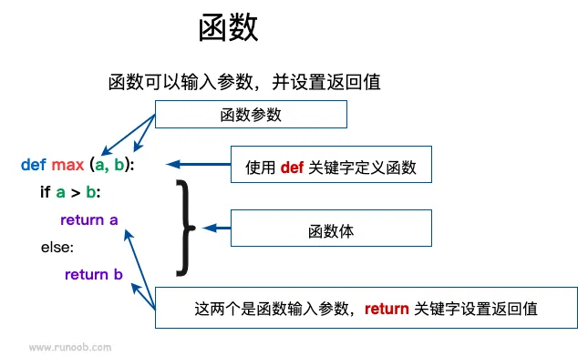

# 1.13 函数（一）

函数是组织好的，可重复使用的，用来实现单一，或相关联功能的代码段。

函数能提高应用的模块性，和代码的重复利用率。你已经知道 Python 提供了许多内建函数，比如`print()`。但你也可以自己创建函数，这被叫做用户自定义函数。

本例中知识比较多，如果采用文字讲解将涉及大量没有太大意义的晦涩的专业术语。因此，我们还是通过摘抄菜鸟教程的示例，用大量的代码块引导大家自行从中总结规律。

## 定义一个函数

还是先放出总体的概念，不求理解，你只需要阅读后查看下面的示例即可。

你可以定义一个实现自己想要功能的函数，以下是简单的规则：

- 函数代码块以`def`关键词开头，后接函数标识符名称和圆括号`()`
- 任何传入参数和自变量必须放在圆括号中间，圆括号之间可以用于定义参数
- 函数内容以冒号`:`起始，并且缩进。
- `return`结束函数，选择性地返回一个值给调用方，不带表达式的`return`相当于返回`None`。



## 例01 一个简单的函数

使用函数来输出`'Hello World!'`：

```python
def hello_1() :
    print('Hello World!')

hello_1()  # 输出：Hello World!
```

前两行语句，我们定义了一个函数`hello`，并在第四行通过`hello()`的形式调用它。

调用函数时，Python 会执行我们定义的函数内容（即第二行），因此本例的运行结果等效于执行第二行的语句。

## 例02 带返回值的函数

更多的时候，我们并不希望一个函数直接完成输出功能，而希望它通过`return`语句将值返回回来，以便程序进行处理。

```python
def hello_2() :
    return 'Hello World!'

print(hello_2())  # 输出：Hello World!
result = hello_2()  # 自然也可以将返回值存入变量
print(result)  # 输出：Hello World!
```

## 例03 带参数函数

```python
def max(a, b):
    if a > b:
        return a
    else:
        return b

print(max(2, 1))  # 输出：2

a = 4
b = 5
print(max(a, b))  # 输出：5
```

本例中，函数`max`接受两个参数`a`与`b`，并通过比较返回两者中的较大值。、

这里我们要对**形式参数**（形参）和**实际参数**（实参）做一个介绍：

- 形式参数：在定义函数或过程的时候命名的参数，通俗讲就是一个记号。形式参数一定要使用变量来存储。

> 形式参数只对这个函数内部有效，函数外部是无法调用形式参数的！

- 实际参数：在程序执行中调用函数时，传递给函数的参数，通俗讲就是实际值。实际参数可能是定量（如第七行的`1`和`2`）或变量（如第十一行的`a`与`b`）

当然，在更多的时候，形式参数与实际参数的名称不会一一对应，这完全不影响程序的运行。

```python
def max(x, y):
    if x > y:
        return x
    else:
        return y
 
a = 4
b = 5
print(max(a, b))  # 输出：5
```

形式参数的定义方式和实际参数的传递方式有着五花八门的方式，你将在下例中见识到。

## 例04 关键字参数

```python
def output(a, b):
    print(a, b)

output(a=2, b=3)  # 输出：2 3
output(b=2, a=3)  # 输出：3 2
```

在传递参数时，我们可以在实际参数前面加上形式参数的名称，以使得代码更加直观和严谨。同时，由于指定了形式参数的名称，因此传递的顺序不再重要，我们可以按照任意顺序进行参数的传递。

“普通方式”和“关键字方式”两种参数传递方式可以混合使用：

```python
def output(a, b, c):
    print(a, b, c)

output(1, 2, 3)  # 输出：1 2 3
output(1, b=2, c=3)  # 输出：1 2 3
output(1, c=2, b=3)  # 输出：1 3 2
output(b=1, c=2, a=3)  # 输出：3 1 2
output(1, c=2, 3)  # 报错SyntaxError：如果混用关键字参数和普通参数，必须普通参数在前
```

## 例05 默认参数

对于一个定义冗长的变量，许多时候会出现绝大多数的用户始终“为一个形式参数传递同样的实际参数”的情况。

因此，Python 允许我们为形式参数指定默认值：

```python
def output(name='小明'):
    print('Hello,', name)

output('小红')  # 输出：Hello, 小红
output(name='异想之旅')  # 输出：Hello, 异想之旅
output()  # 输出：Hello, 小明
```

需要注意的是，在定义时，带默认值的参数必须放在普通参数的后面：

```python
def output(name, lang='chinese'):
    if lang == 'chinese':
        print('你好，' + name)
    else:
        print('Hello, ' + name)

output('小红', 'english')  # 输出：Hello, 小红
output('小红')  # 输出：你好，小红
output(name='异想之旅', lang='chinese')  # 输出：你好，异想之旅
```

## 关于`print`函数……

我们发现，在定义函数时，需要我们明确指定函数接收几个参数，并且传参时也要严格遵守此规定，否则程序将报错。

然而`print`函数却可以实现下面这样的场景：

```python
print(1)  # 1
print(1, 2)  # 1 2
print(1, 2, 3)  # 1 2 3
...
print(1, 2, 3, ..., n)  # 1 2 3 ... n
```

这是为什么呢？为什么`print`可以不预先定义接收多少个参数也能成功运行？难道这是 Python 内置函数的“特权”？

这个问题我们将在第二部分中的《函数（二）》章节中做出解答，有兴趣的同学可以前去查看~
