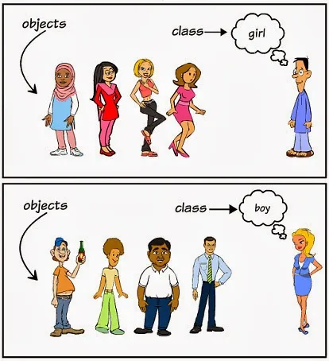
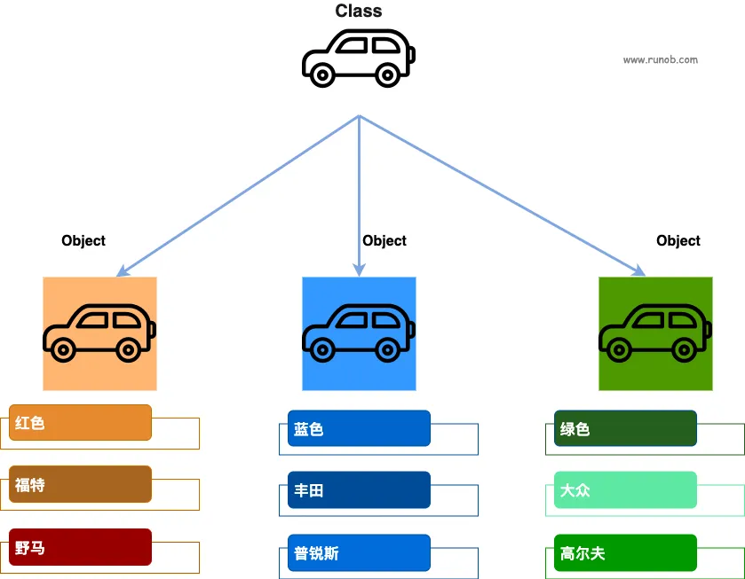
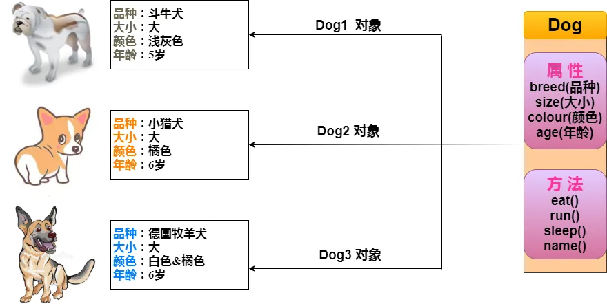

# 2.1 类和对象概念

本节力求让大家理解我们一直在提及的类和对象的概念。本节主要内容节选自 [Java 对象和类 | 菜鸟教程](https://www.runoob.com/java/java-object-classes.html) （只有概念，不包含代码，所以不涉及 Java），这是使我真正理解类和对象的一篇文章，希望也能帮到大家。

- **对象**：对象是类的一个实例（**对象不是找个女朋友**），有状态和行为。例如，一条狗是一个对象，它的状态有：颜色、名字、品种；行为有：摇尾巴、叫、吃等。
- **类**：类是一个模板，它描述一类对象的行为和状态。

下图中**男孩（boy）**、**女孩（girl）**为**类（class）**，而具体的每个人为该类的**对象（object）**：

下图中**汽车**为**类（class）**，而具体的每辆车为该**汽车**类的**对象（object）**，对象包含了汽车的颜色、品牌、名称等。

现在让我们深入了解什么是对象。看看周围真实的世界，会发现身边有很多对象，车，狗，人等等。所有这些对象都有自己的状态和行为。

拿一条狗来举例，它的状态有：名字、品种、颜色，行为有：叫、摇尾巴和跑。

对比现实对象和编程中的对象，它们之间十分相似。

编程中的对象也有状态和行为。软件对象的状态就是属性，行为通过方法体现。

在编程中，方法操作对象内部状态的改变，对象的相互调用也是通过方法来完成。

**类可以看成是创建对象的模板。**

例如从下图中，显而易见的，三个 Dog 对象都是基于一个模板定义的。

**对象必须基于类来创建；而类是抽象的模板，如果没有具体到一个对象上，类本身的属性和方法是没有意义的。**
