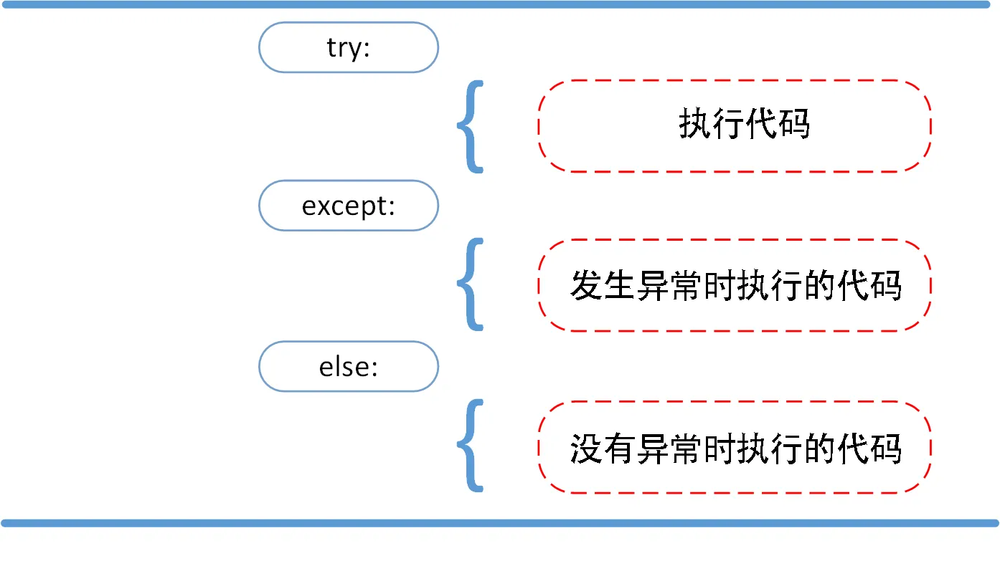

# 3.3 错误处理

## 错误

Python 中的错误主要指语法错误，例如：

```python
>>> while True print('Hello world')
  File "<stdin>", line 1, in ?
    while True print('Hello world')
                   ^
SyntaxError: invalid syntax
```

语法分析器指出了出错的一行，并且在最先找到的错误的位置标记了一个小小的箭头。

语法错误是不可以被捕获的。

## 异常

这才是我们今天要讨论的重点。

我们先来看一些常见的异常：

```python
>>> 10 * (1/0)             # 0 不能作为除数，触发异常
Traceback (most recent call last):
  File "<stdin>", line 1, in ?
ZeroDivisionError: division by zero
>>> 4 + spam*3             # spam 未定义，触发异常
Traceback (most recent call last):
  File "<stdin>", line 1, in ?
NameError: name 'spam' is not defined
>>> '2' + 2               # int 不能与 str 相加，触发异常
Traceback (most recent call last):
  File "<stdin>", line 1, in <module>
TypeError: can only concatenate str (not "int") to str
```

异常以不同的类型出现，这些类型都作为信息的一部分打印出来：例子中的类型有``` ZeroDivisionError``NameError ```和`TypeError`。

异常信息的前面部分显示了异常发生的上下文（即发生异常位置的代码），并以调用栈的形式显示具体信息（如若嵌套多层的函数调用出现异常，则打出每一层调用）。后面部分则是异常的详情。

对于大多数异常，如果我们不知道怎么解决、需要寻求帮助的话就要在搜索引擎输入这些内容，例如对于`'2' + 2`语句报错的解决情况应搜索`TypeError: can only concatenate str (not "int") to str`。

## 异常捕获

### 捕获异常

```python
while True:
    try:
        x = int(input('请输入一个数字: '))
        break
    except ValueError:
        print('您输入的不是数字，请再次尝试输入！')
print('END')
```

运行结果：

```
请输入一个数字: a
您输入的不是数字，请再次尝试输入！
请输入一个数字: -
您输入的不是数字，请再次尝试输入！
请输入一个数字: 1
END
```

`try`语句按照如下方式工作；

- 首先，执行`try`子句（在关键字`try`和关键字`except`之间的语句）。
- 如果没有异常发生，忽略`except`子句，`try`子句执行后结束。
- 如果在执行`try`子句的过程中发生了异常，那么`try`子句余下的部分将被忽略。如果异常的类型和`except`之后的名称相符，那么对应的`except`子句将被执行。
- 如果一个异常没有与任何的`except`匹配，那么这个异常将会传递给上层的`try`（若有）或抛出。

一个`try`语句可能包含多个`except`子句，分别来处理不同的特定的异常。最多只有一个分支会被执行，如果一个异常匹配多个`except`，则执行第一个。

处理程序将只针对对应的`try`子句中的异常进行处理，而不是其他的`try`的处理程序中的异常。

### 捕获多个异常

一个`except`子句可以同时处理多个异常，这些异常将被放在一个括号里成为一个元组，例如：

```python
except (RuntimeError, TypeError, NameError):
    pass
```

### 捕获所有未被捕获的异常

每个`try`的最后一个`except`子句可以忽略异常的名称，它将被当作通配符使用。你可以使用这种方法打印一个错误信息，然后再次把异常抛出：

```python
try:
    f = open('myfile.txt')
    s = f.readline()
    i = int(s.strip())
except OSError as err:
    print('文件未找到')
    raise err  # 处理完成后再次抛出异常
except ValueError:
    print('文件中不是整数')
except:
    print('Unexpected error')
    raise  # except 中也可以直接使用 raise 抛出捕获的异常
```

我们在 2.1 中已经学习了类和对象的知识。事实上，这些异常全部都是类，而它们有一个共同的父类`Exception`。因此，像第十行这样的匹配所有未捕获错误的`except`语句也可以这么写：

```python
try:
    ...
except Exception as e:
    print(e)
```

### else 子句

`try/except`语句还有一个可选的`else`子句，`else`子句将在`try`子句没有发生任何异常的时候执行。

如果使用这个子句，那么必须放在所有的`except`子句之后。



来看一个简单的例子：

```python
try:
    f = open(file, 'r')
except IOError:
    print('Cannot open.')
else:
    print(f.read())
    f.close()
```

## finally 子句

`finally`语句是无论是否发生异常都将执行最后的代码。

```python
try:
    pass
except Exception as e:
    print(e)
else:
    1 / 0
finally:
    print('finally')
```

输出：

```
finally
Traceback (most recent call last):
  File "e:\Programming\Python\临时\a.py", line 6, in <module>
    1 / 0
ZeroDivisionError: division by zero
```

可以看到，Python 先执行了`finally`中的语句，然后才将错误抛出。因此，将清理语句写在`finally`中是安全的，只要设备不断电，它一定会执行。

## 主动抛出异常

Python 可以使用`raise`语句主动抛出异常：

```python
>>> raise ValueError('123') 
Traceback (most recent call last):
  File "<stdin>", line 1, in <module>
ValueError: 123
>>> raise Exception
Traceback (most recent call last):
  File "<stdin>", line 1, in <module>
Exception
>>> raise IndexError('Illegal index') 
Traceback (most recent call last):
  File "<stdin>", line 1, in <module>
IndexError: Illegal index
```

## 自定义异常类

你可以通过创建一个新的异常类来拥有自己的异常。异常类继承自`Exception`类，可以直接继承，或者间接继承。例如：

```python
>>> class MyError(Exception):
        def __init__(self, value):
            self.value = value
        def __str__(self):
            return repr(self.value)
   
>>> try:
        raise MyError(2*2)
    except MyError as e:
        print('My exception occurred, value:', e.value)
   
My exception occurred, value: 4
>>> raise MyError('oops!')
Traceback (most recent call last):
  File "<stdin>", line 1, in ?
__main__.MyError: 'oops!'
```

## assert 断言

Python `assert`（断言）用于判断一个表达式，在表达式条件为`False`的时候触发异常。

断言可以在条件不满足程序运行的情况下直接返回错误，而不必等待程序运行后出现崩溃的情况，例如我们的代码只能在 Linux 系统下运行，可以先判断当前系统是否符合条件。通常在我们写脚本时用到。

- 语法格式：`assert expression`
- 等价的`if`语句：`if not expression: raise AssertionError`
- `assert`后面也可以紧跟参数：`assert expression [, arguments]`
- 等价语句：`if not expression: raise AssertionError(arguments)`

示例：

```python
>>> assert True     # 条件为 True 正常执行
>>> assert False    # 条件为 False 触发异常
Traceback (most recent call last):
  File "<stdin>", line 1, in <module>
AssertionError
>>> assert 1 == 1    # 条件为 True 正常执行
>>> assert 1 == 2    # 条件为 False 触发异常
Traceback (most recent call last):
  File "<stdin>", line 1, in <module>
AssertionError
>>> assert 1 == 2, '1 不等于 2'
Traceback (most recent call last):
  File "<stdin>", line 1, in <module>
AssertionError: 1 不等于 2
```
