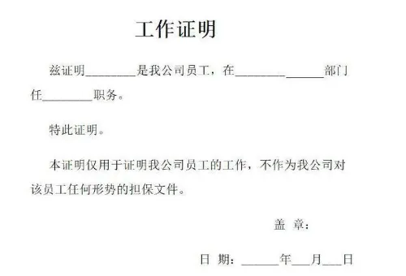
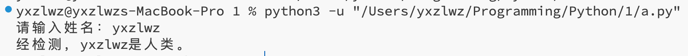

# 3.8 字符串格式化

## 有什么用

你一定见过很多这样有留空的文件：



这样的文件中的留空用于未来填入不同的信息。而在编程中，我们也时常需要根据获取到的数据生成格式相同、内容不同的字符串。

举个例子：

```python
name = input('请输入姓名：')
print(f'经检测，{name}是人类。')
```

运行结果如下：



格式化字符串的方法主要有三种：format函数、百分号、f-string。个人认为，在绝大多数情况下这三种方法都能在功能上满足需求，而f-string比其余两种更加直观。

> 与前面的风格不完全一样，本节中的代码全部都是直接在交互式终端（IDLE）中执行的。

## format函数

### 基本用法

```python
>>> '{}喜欢吃{}'.format('我', '冰激凌')  # 在字符串中使用“{}”为要填入的数据保留位置
'我喜欢吃冰激凌'
>>> '{1}喜欢吃{0}，{0}和{0}'.format('冰激凌', '我')  # 在{}中填入数字指定数据填入的顺序，亦可重复某个数据
'我喜欢吃冰激凌，冰激凌和冰激凌'
>>> '{name}喜欢吃{food}'.format(name='我', food='冰激凌')  # 可以对数据进行命名
'我喜欢吃冰激凌'
>>> '{name}喜欢吃{}年的{food}'.format(2025, name='我', food='冰激凌')  # 两种模式可以混合，但混合时format函数的括号中需要先填写未命名的数据（字符串中{}的位置不影响）
'我喜欢吃2025年的冰激凌'
```

### 索引

适用于当format中传入的数据为列表、字典等类型时。

```python
>>> '{[0]}'.format('这是一个字符串')
'这'
>>> '{cities[1]}'.format(cities=['北京', '上海', '广州'])
'上海'
>>> '{student[name]}'.format(student={
...     'name': 'yxzlwz',
...     'id': '1'
... })  # 注意：字典的key不要加引号
'yxzlwz'

>>> '{:.2}'.format('这是一个字符串')  # 取前两项
'这是'

>>> '{[1]}'.format({'1': 1, 1: 2})  # 这是我写教程的时候做的一个实验，有兴趣可以看一下
'2'
```

> 在旧版本的Python中（具体版本号我不确定），`'{[0]}'.format(['北京', '上海', '广州'])` 这样的代码是不合法的，必须写为 `'{0[0]}'.format(['北京', '上海', '广州'])`。

### 数字类型

格式化数字时，在大括号中输入冒号和控制信息。

```python
>>> '{:d} {:f}'.format(100, 9.9)  # 整数使用d，小数使用f
'100 9.900000'
>>> '{:.1f}'.format(1.05)  # 指定保留多少位小数，四舍五入
'1.1'
>>> '{:.0f}'.format(1.05)  # 将小数四舍五入为整数
'1'
>>> '{num:.0f}'.format(num=1.05)  # 之前的写法都可以正常使用
'1'
```

剩下的看图吧……


表中的许多写法都是可以合法组合的，例如：

```python
>>> '{:*>8.1f}'.format(1.05)
'*****1.1'
>>> '{:-<6.2}'.format('abcdefg')
'ab----'
```

### 输出大括号

使用 `{{}}` 来输出正常的大括号。

```python
>>> "{} 对应的位置是 {{0}}".format("yxzlwz")
'yxzlwz 对应的位置是 {0}'
```

## 百分号


## f-string

**这是我最喜欢的格式化方式！**

输入 f-string 的方式很简单，你只需要在左边的引号前（无论单引号还是双引号）添加一个 `f`，然后即可在字符串中使用大括号来表示内容。无需其它占位符，你可以直接输入数据本身，例如一个变量：

```python
name = 'yxzlwz'
email = 'yxzlwz@gmail.com'
print(f'{name}的邮箱是{email}')
# 输出：yxzlwz的邮箱是yxzlwz@gmail.com
```

f-string 的强大来源于它的朴素——你可以在大括号中间插入任何类型的内容，无论是变量、函数调用还是一个复杂的表达式。没有任何特殊的格式要求，就像你平时编写代码一样随意：

```python
text = 'Hello World!'
print(f'我想说：{text}')  # 可以是变量
print(f'我说了 {len(text)} 个字符')  # 可以是函数调用
print(f'第一个单词是 {text[:5]}')  # 可以是任何合法的Python表达式
print(f'{round(3.1415926, 2)}')  # 用最朴素的方式保留小数

student = {'name': 'yxzlwz', 'age': 18}
print(f'{student["name"]}的年龄是{student["age"]}岁')
```

上面代码的输出如下：

```
我想说：Hello World!
我说了 12 个字符
第一个单词是 Hello
yxzlwz的年龄是18岁
```

唯一需要注意的一点是，上例中最后一行从字典中取值时，外层字符串使用的是单引号 `f'...'`，为了不影响原有字符串的开始和结束，中间大括号内的 `student["name"]` 和 `student["age"]` 使用双引号。

我们依旧可以通过 `{{}}` 来输出一个平平无奇的大括号：

```python
>>> a = 'hello'
>>> f'{{}}'
'{}'
>>> f'{{a}}'
'{a}'
```

